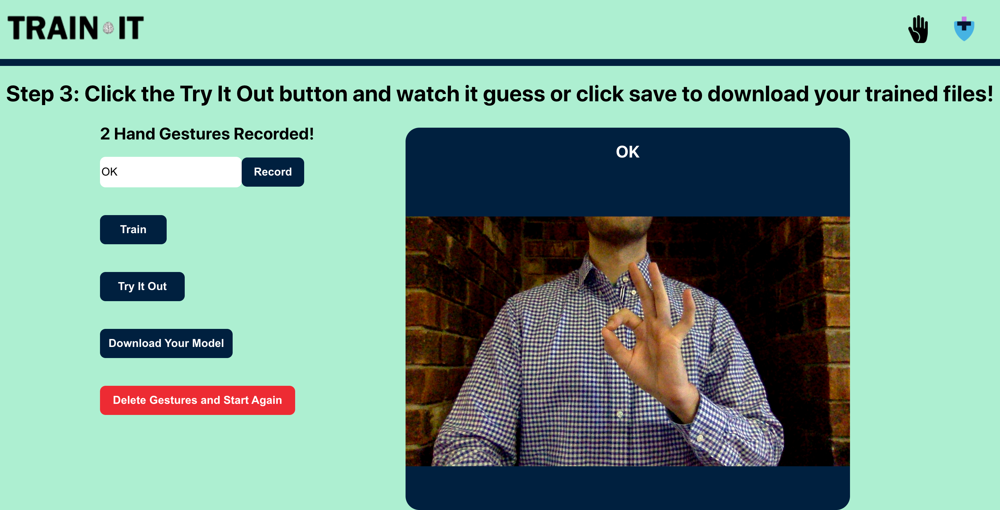
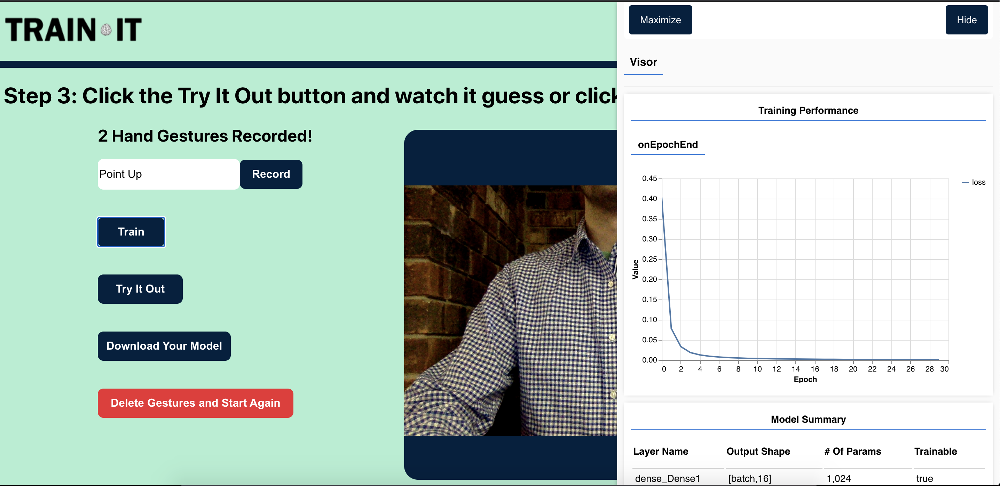

# TRAIN-IT
      
    

## Description

This gesture training app allows the user to have a hands on experience with training a neural network to recognize hand gestures. This can be fun to interract with, and when used in conjunction with [HAND-IT](https://www.npmjs.com/package/hand-it) can be a powerful tool that adds custom hand gesture control to your React.js applications.  Using the power of Tensorflow.js and ML5, this application will train itself with your own hand gestures and recognize them based on the names you input.

​
​

## Table of Contents

* [Instructions](#instructions)
* [Sample Hand Gestures](#sample-hand-gestures)
* [License](#license)
* [Questions](#questions)

## Instructions

1. Name and record at least 2 different hand gestures. (The more gestures you record, the more accurate the app will be)
2. Click the "Train" button and watch the neural network learn your hand gestures. You can see the margin of error decrease on the graph as it learns.
3. Once the training reaches 30 epochs, you can click "Try It Out" to see it work. Hold any of the gestures you've recorded in front of the camera and watch the application accurately guess what gesture you are holding up.
4. (Optional) If you are making your own hand controlled React.js application using [HAND-IT](https://www.npmjs.com/package/hand-it), you can click "Download Your Model" and the files you need will be dowloaded into your downloads folder.

## Sample Hand Gestures

Some sample hand gestures that you might want to try:
1. Point Up
2. Point Down
3. Point Left
4. Point Right
5. OK
6. Fist
7. Peace

## License

Copyright (c) 2020 Jacob Lovins

    Permission is hereby granted, free of charge, to any person obtaining a copy
    of this software and associated documentation files (the "Software"), to deal
    in the Software without restriction, including without limitation the rights
    to use, copy, modify, merge, publish, distribute, sublicense, and/or sell
    copies of the Software, and to permit persons to whom the Software is
    furnished to do so, subject to the following conditions:

    The above copyright notice and this permission notice shall be included in all
    copies or substantial portions of the Software.

    THE SOFTWARE IS PROVIDED "AS IS", WITHOUT WARRANTY OF ANY KIND, EXPRESS OR
    IMPLIED, INCLUDING BUT NOT LIMITED TO THE WARRANTIES OF MERCHANTABILITY,
    FITNESS FOR A PARTICULAR PURPOSE AND NONINFRINGEMENT. IN NO EVENT SHALL THE
    AUTHORS OR COPYRIGHT HOLDERS BE LIABLE FOR ANY CLAIM, DAMAGES OR OTHER
    LIABILITY, WHETHER IN AN ACTION OF CONTRACT, TORT OR OTHERWISE, ARISING FROM,
    OUT OF OR IN CONNECTION WITH THE SOFTWARE OR THE USE OR OTHER DEALINGS IN THE
    SOFTWARE.

## Questions

If you have any further questions, you can reach me directly here: lovins.jacob@yahoo.com

You can find more of my work at [https://github.com/jacoblovins/](https://github.com/jacoblovins/).
